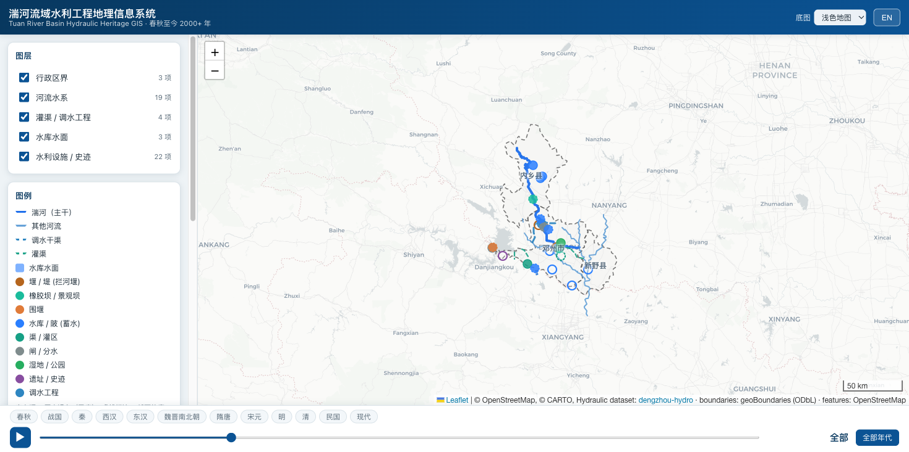
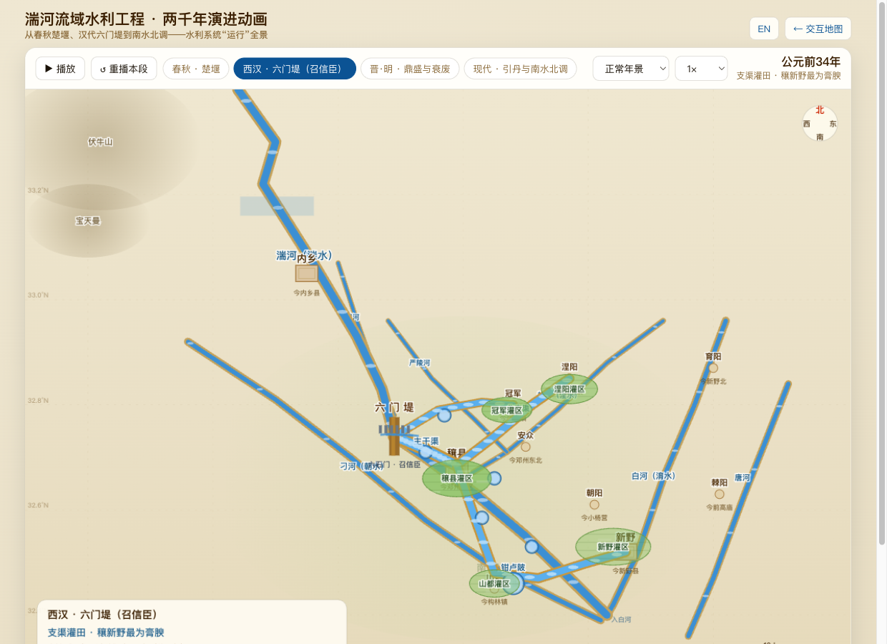

# 湍河流域水利工程地理信息系统 · Tuan River Basin Hydraulic Heritage GIS

> 一个围绕**湍河流域**、跨越**两千余年**（春秋 → 汉 → 今）的水利工程地理信息系统，覆盖河南省**邓州市、内乡县、新野县**全境。
>
> A bilingual web GIS of **2,000+ years** of water-conservancy works (Spring & Autumn → Han → present) in the **Tuan River (湍河) basin** — **Dengzhou City, Neixiang County and Xinye County**, Henan, China.

<p align="center">
  
</p>

<p align="center">
  <a href="#-中文说明">中文</a> ·
  <a href="#-english">English</a> ·
  <a href="https://alexmorerich.github.io/dengzhou-hydro/"><b>🗺️ 交互地图 / Interactive map</b></a> ·
  <a href="https://alexmorerich.github.io/dengzhou-hydro/demo.html"><b>▶ 动画演示 / Live animation</b></a> ·
  <a href="docs/history.md">水利史 / History</a> ·
  <a href="docs/data-sources.md">数据来源 / Data sources</a>
</p>

<p align="center">
  <a href="https://alexmorerich.github.io/dengzhou-hydro/demo.html">
    
  </a>
  <br>
  <em>▶ 点击观看「两千年水利演进」Canvas 动画 · Click to watch the 2,000-year hydraulic-evolution animation</em>
</p>

<p align="center">
  
  
  
  
</p>

---

## 🌊 中文说明

### 项目简介

**湍河**（古称*湍水*）发源于伏牛山（内乡境内宝天曼一带），向东南穿内乡、邓州，于新野汇入白河，属唐白河→汉江→长江水系，干流约 215 km，流域约 4,800 km²。两千多年来，这条河及其支流（刁河、赵河、严陵河等）上修筑了大量水利工程——从春秋楚国的**楚堰**、西汉召信臣的**六门堤**，到今天的**南水北调中线湍河渡槽**与各座水库。

本项目把这些工程汇集到一张**可交互、带时间轴、中英双语**的网页地图上：

- **地理范围**：邓州市、内乡县、新野县三县（市）全境。
- **时间跨度**：公元前 770 年（春秋）至今，逾 2000 年。
- **工程类型**：拦河堰（**六门堤**）、陂塘/水库（**各种蓄水湖**）、**围堰**、灌渠与调水工程、橡胶坝、湿地公园、渠首水闸，以及**湍河**本身及其水系。

### 在线访问与本地运行

- **在线地图**：<https://alexmorerich.github.io/dengzhou-hydro/>（GitHub Pages）
- **本地运行**（需要一个本地服务器，因为浏览器会拦截 `file://` 下的 `fetch`）：

  ```bash
  git clone https://github.com/alexmorerich/dengzhou-hydro.git
  cd dengzhou-hydro
  python3 -m http.server 8000
  # 浏览器打开 http://localhost:8000
  ```

  无需任何构建步骤或依赖安装——纯静态 HTML/CSS/JS，仅在运行时从 CDN 加载 Leaflet 与底图瓦片（需联网）。

### 功能特性

| 功能 | 说明 |
|---|---|
| 🕰️ **时间轴** | 拖动底部滑块在公元前 770 年—2026 年间穿行；只显示该年份**存在**的工程；自然河流始终显示。可按朝代（春秋/西汉/现代…）一键跳转，或点击 ▶ 自动播放“水利演变史”。 |
| 🗺️ **分层图层** | 行政区界、河流水系、灌渠/调水、水库水面、水利设施/史迹，可逐层开关。 |
| 🔖 **要素弹窗** | 双语名称、类型、年代/朝代、营建者、说明，以及**可点击的史料/数据来源链接**（保留历史来源追溯）。 |
| 🌐 **中英双语** | 界面、图例、时间线、弹窗一键切换 `中文 / EN`。 |
| 🎯 **史迹定位** | 在侧栏时间线点击任一工程，地图会“穿越”到它的始建年代并定位、弹窗。 |
| 🛰️ **多种底图** | 浅色/标准/卫星影像/深色，均为 WGS-84，与矢量数据精确对齐。 |
| 📱 **响应式** | 桌面与移动端自适应，侧栏可折叠。 |

### ▶ 动画演示（Canvas）

除交互地图外，[`demo.html`](demo.html)（[在线](https://alexmorerich.github.io/dengzhou-hydro/demo.html)）用纯 Canvas 动画把流域水利工程的**运行过程**“放映”出来——无框架、单文件、可手机直接打开，地理坐标与 GIS 数据一致（WGS-84）。四个阶段自动循环：

1. **春秋 · 楚堰** —— 上游八级跌水陂塘蓄水、灌田。
2. **西汉 · 六门堤（召信臣）** —— 拦河抬水 → 六门开闸 → 主干渠输水 → 陂堰蓄调（长藤结瓜）→ 支渠灌田；可切换**正常 / 丰水分洪 / 枯水保灌**三种水情。
3. **晋·明 · 鼎盛与衰废** —— 杜预复廿九陂、明增至卅八陂，至明末淤废。
4. **现代 · 引丹与南水北调** —— 陶岔引丹、总干渠输水、南水北调中线经**湍河渡槽**跨河北送、水库蓄水、城区橡胶坝与湿地。

支持：▶ 播放/暂停、按朝代跳段、调速、**中英文一键切换**。

### 收录的水利工程（节选）

> 完整的历史脉络见 [`docs/history.md`](docs/history.md)。可信度（confidence）标注每条记录的考证/定位把握程度。

| 年代 | 工程 | 营建 | 县域 | 可信度 |
|---|---|---|---|---|
| 春秋·楚 | **楚堰（楚堨）** 八级跌水蓄水陂 | 楚国 | 邓州 | 中 |
| 春秋战国·楚 | **楚长城（方城）** “以汉水为池” | 楚国 | 邓州 | 中 |
| 西汉 前34年 | **六门堤（六门陂）** ⭐ 断湍水、六石门、下结廿九陂 | **召信臣** | 邓州 | 高 |
| 西汉 前34年 | **钳卢陂** 跨刁河—湍河调水 | 召信臣 | 邓州 | 高 |
| 汉 | 邓氏陂 / 樊氏陂 / **新野陂** | — | 邓州 / 新野 | 中 |
| 东汉末 208年 | 运粮河（曹操军运粮渠） | 曹操军 | 邓州 | 低 |
| 西晋 282年 | 杜预复六门陂、下结廿九陂 | 杜预 | 邓州 | 高 |
| 明 1554年 | 六门陂重修，增至三十八陂十四堰 | 王道升 | 邓州 | 中 |
| 民国—今 1942 | **湍惠渠** 渠首（550 m 拦河堰） | — | 邓州 | 中 |
| 现代 1969–1981 | **打磨岗 / 斩龙岗 / 云露湖**等水库 | 内乡县 | 内乡 | 中 |
| 现代 1974 | **引丹灌区**（自丹江口经陶岔渠首） | 十万民工 | 邓州/新野 | 高 |
| 现代 2014 | **南水北调中线·湍河渡槽** 世界最大 U 形渡槽 | 国家工程 | 邓州 | 高 |
| 现代 2014 | **湍河国家湿地公园** | 邓州市 | 邓州 | 高 |
| 现代 | **围堰**（陶岔渠首施工纵向围堰；亦为古代筑陂之法） | — | 渠首/源头 | 低 |

关于 **围堰**：在湍河流域，“围堰/围堤”自古就是**筑陂蓄水的施工方法**——六门陂、钳卢陂都是“四周修筑围堤”壅水成库；近现代则见于陶岔渠首等工程的临时纵向混凝土围堰。本系统因此把围堰同时作为“工程要素”和“营造技术”加以呈现。

### 数据图层与字段

所有矢量数据均为 **GeoJSON（WGS-84 / EPSG:4326）**，位于 [`data/`](data/)：

| 文件 | 几何 | 内容 |
|---|---|---|
| `admin-boundaries.geojson` | 面 | 邓州、内乡、新野三县界（geoBoundaries） |
| `rivers.geojson` | 线 | 湍河、刁河、赵河、白河、唐白河、严陵河等水系，**含古今名称**（湍河/湍水…）（OSM + 考订） |
| `canals.geojson` | 线 | 南水北调中线总干渠、引丹渠、清泉沟隧洞、腰兴渠（OSM） |
| `historical-channels.geojson` | 线/点 | **湍河历史河道变迁**：古湍水道、汉六门引水入刁河、老白河（1570 前）、古今汇流口、岗头改道点（考订；随时间轴显示） |
| `osm-reservoir-surfaces.geojson` | 面 | 张沟、王营、滕庄等水库水面（OSM） |
| `places.geojson` | 点 | **县城·乡镇·村共 127 处**，含古今地名（穰东镇/涅阳…）；按缩放分级显示（OSM 现名 + 人工考订古名） |
| `hydraulic-structures.geojson` | 点 | 历代水利设施与史迹（六门堤、围堰、各水库、渡槽、橡胶坝…） |
| `sources/overpass-water.json`, `sources/osm-places.json` | — | 构建上述 OSM 图层所用的原始 Overpass 抽取（可复现） |

**核心字段（每个要素）**：

```jsonc
{
  "name_zh": "六门堤（六门堰·六门陂）",   // 中文名
  "name_en": "Six-Gate Weir (Liumen Weir / Reservoir)",
  "category": "weir",                    // weir/dam/cofferdam/reservoir/canal/sluice/rubber_dam/wetland/site/diversion …
  "era_start": -34,                      // 始建年（负数=公元前）
  "era_end": 1644,                       // 废弃年；2026 表示沿用至今
  "era_label_zh": "西汉·元帝", "era_label_en": "Western Han · Emperor Yuan",
  "builder_zh": "召信臣", "builder_en": "Shao Xinchen",
  "description_zh": "…", "description_en": "…",
  "status_zh": "遗址", "status_en": "Relict",
  "confidence": "high",                  // high / medium / low（含定位与考证把握度）
  "source": "《水经注·湍水》; 《汉书·循吏传》",
  "source_url": "https://zh.wikipedia.org/wiki/召信臣"
}
```

### 项目结构

```
dengzhou-hydro/
├── index.html              # 交互地图入口
├── demo.html               # ▶ Canvas 水利演进动画（独立单文件）
├── src/
│   ├── app.js              # 地图逻辑：加载、时间过滤、弹窗、时间线、双语
│   ├── config.js           # 图层清单、朝代分期、要素配色、底图
│   ├── i18n.js             # 中英文案与年份格式化
│   └── style.css           # 水文主题样式（响应式）
├── data/                   # GeoJSON 数据（见上表）
│   └── sources/            # 可复现的原始数据抽取
├── scripts/
│   ├── build_data.py       # 由史料 + OSM 抽取生成数据图层（可重跑）
│   └── build_places.py     # 生成城邑·乡镇·村图层 + 河流古今名（可重跑）
├── docs/
│   ├── history.md          # 详细水利史（双语）
│   └── data-sources.md     # 数据来源、版权与方法
└── assets/                 # 图标与截图
```

### 重建数据

历史要素的属性与坐标在 [`scripts/build_data.py`](scripts/build_data.py) 中以结构化表格维护（坐标依据“邓州城关 + 史载方位里程”推定，可信度逐条标注）。修改后重跑即可重新生成数据：

```bash
python3 scripts/build_data.py    # → hydraulic-structures / osm-reservoir-surfaces / canals
python3 scripts/build_places.py  # → places.geojson + 为 rivers.geojson 补古今名称
```

如需刷新 OSM 抽取，可用 `data/sources/overpass-water.json` 顶部记录的 Overpass 查询重新拉取。

### 准确性说明 / 已知局限

- **历史坐标为推定值**。古代工程多无经纬度记载，本系统依据城关锚点与史载方位（“城西三里”“东南六十里”等）反推，仅供检索与展示之用，`confidence` 字段如实标注把握度，建议结合实地踏勘核校。
- **行政区界为简化版**（geoBoundaries ADM3 simplified），西南山区边界较粗，个别近边界要素（如彭桥镇水库）可能落在简化界线之外。
- **OSM 水库覆盖不全**：湍河流域多数中小型水库未入 OSM，故以政府名录 + 推定坐标补充为点要素，水面多边形仅对已入 OSM 者绘制。
- **史料互有出入**：六门堤的灌溉顷数、第三受益县（昆阳/涅阳/朝阳）、282 年大修者（杜预 vs 杜诗）等历来有异说，详见 [`docs/history.md`](docs/history.md) 的“存疑”小节。

### 许可证

- **代码**：MIT。
- **数据**：本项目原创编纂的史迹数据采用 **CC BY-SA 4.0**；行政区界来自 **geoBoundaries（CC BY 4.0）**；河流/水库/渠系几何来自 **OpenStreetMap（ODbL 1.0）**，© OpenStreetMap 贡献者。详见 [`docs/data-sources.md`](docs/data-sources.md) 与 [`LICENSE`](LICENSE)。

### 致谢

底图 © OpenStreetMap / CARTO / Esri；行政区界 © geoBoundaries；史料引自《水经注》《汉书·循吏传》《后汉书·杜诗传》《元和郡县志》及邓州、内乡、新野地方记述。

---

## 🌊 English

### Overview

The **Tuan River** (湍河, anc. *Tuanshui*) rises in the Funiu Mountains (Baotianman, in Neixiang), flows south-east through Neixiang and Dengzhou, and joins the **Bai River** in Xinye — part of the Tang-Bai → Han → Yangtze system. Its main stem runs ~215 km over a ~4,800 km² basin. For more than two millennia people have built water-conservancy works along it and its tributaries (the Diao, Zhao and Yanling rivers) — from the **Chu Weir** of the Spring & Autumn period and **Shao Xinchen's Six-Gate Weir** of the Western Han, to today's **Tuanhe Aqueduct** on the South-to-North Water Transfer and a constellation of reservoirs.

This project brings them together on one **interactive, time-aware, bilingual** web map:

- **Geographic scope**: the full extents of **Dengzhou City, Neixiang County and Xinye County**.
- **Temporal scope**: 770 BCE (Spring & Autumn) to the present — over 2,000 years.
- **Feature types**: the **Six-Gate Weir** and other barrages, **reservoirs / impounded lakes** (the "various 蓄水湖"), **cofferdams**, canals and water-transfer works, rubber dams, a wetland park, headworks/sluices, and the **Tuan River** and its drainage itself.

### Live demo & running locally

- **Live map**: <https://alexmorerich.github.io/dengzhou-hydro/> (GitHub Pages)
- **Run locally** (a local server is needed — browsers block `fetch` over `file://`):

  ```bash
  git clone https://github.com/alexmorerich/dengzhou-hydro.git
  cd dengzhou-hydro
  python3 -m http.server 8000
  # open http://localhost:8000
  ```

  No build step and no install: it is plain static HTML/CSS/JS that loads Leaflet and basemap tiles from a CDN at runtime (internet required).

### Features

| Feature | Description |
|---|---|
| 🕰️ **Time slider** | Scrub from 770 BCE to 2026; only works **extant** in the selected year are shown; natural rivers always appear. Jump by dynasty (Spring & Autumn / Western Han / Modern …) or press ▶ to animate the evolution of the basin's hydraulics. |
| 🗺️ **Toggleable layers** | County boundaries, rivers, canals/transfers, reservoir surfaces, hydraulic works & sites. |
| 🔖 **Feature popups** | Bilingual name, type, era/dynasty, builder, notes, and a **clickable link to the historical/data source** (every record keeps its provenance). |
| 🌐 **Bilingual** | One-click `中文 / EN` for UI, legend, timeline and popups. |
| 🎯 **Timeline locate** | Click any work in the sidebar timeline and the map "time-travels" to its founding year, flies there and opens the popup. |
| 🛰️ **Multiple basemaps** | Light / standard / satellite / dark, all WGS-84, aligned with the vector data. |
| 📱 **Responsive** | Works on desktop and mobile; the sidebar collapses. |

### ▶ Live animation (Canvas)

Besides the interactive map, [`demo.html`](demo.html) ([live](https://alexmorerich.github.io/dengzhou-hydro/demo.html)) uses a pure-Canvas animation to *play* the basin's water systems **in operation** — no framework, single file, opens on a phone, with geography consistent with the GIS data (WGS-84). Four stages auto-loop:

1. **Spring & Autumn · Chu Weir** — eight stepped impoundments on the upper Tuan filling and watering fields.
2. **Western Han · Six-Gate Weir (Shao Xinchen)** — dam & raise → open the six gates → main canal → ponds buffer the flow ("vine & melons") → branch canals irrigate; toggle **normal / flood-spill / drought** regimes.
3. **Jin–Ming · Peak & Decline** — Du Yu's 29 ponds, Ming's 38, then siltation.
4. **Modern · Yindan & South-to-North Transfer** — Taocha intake, the Yindan canal, the Middle Route crossing the Tuan on the **Tuanhe Aqueduct**, reservoirs filling, urban rubber dam & wetland.

Controls: ▶ play/pause, jump by dynasty, speed, and one-click **中文 / English**.

### Selected works covered

> The full narrative is in [`docs/history.md`](docs/history.md). The `confidence` rating reflects how well-attested and well-located each record is.

| Era | Work | Builder | County | Conf. |
|---|---|---|---|---|
| Spring & Autumn · Chu | **Chu Weir** (eight stepped impoundments) | State of Chu | Dengzhou | med |
| S&A–Warring States · Chu | **Chu Great Wall** (rivers as moats) | State of Chu | Dengzhou | med |
| Western Han, 34 BCE | **Six-Gate Weir** ⭐ — dammed the Tuan, six stone gates, ~29-pond network | **Shao Xinchen** | Dengzhou | high |
| Western Han, 34 BCE | **Qianlu Reservoir** — Diao↔Tuan inter-basin transfer | Shao Xinchen | Dengzhou | high |
| Han | Dengshi / Fanshi / **Xinye** reservoirs | — | Dengzhou / Xinye | med |
| Late Han, AD 208 | Grain-Transport Canal (Cao Cao) | Cao Cao's army | Dengzhou | low |
| Western Jin, AD 282 | Du Yu restores the Six-Gate system (29 ponds) | Du Yu | Dengzhou | high |
| Ming, 1554 | Rebuilt to 38 ponds + 14 weirs | Wang Daosheng | Dengzhou | med |
| Republic→now, 1942 | **Tuanhui Canal** headworks (550 m weir) | — | Dengzhou | med |
| Modern, 1969–1981 | **Damogang / Zhanlonggang / Yunluhu** reservoirs | Neixiang Co. | Neixiang | med |
| Modern, 1974 | **Yindan irrigation district** (from Danjiangkou via Taocha) | ~100,000 laborers | Dengzhou/Xinye | high |
| Modern, 2014 | **Tuanhe Aqueduct** — world's largest U-shaped aqueduct (S-to-N) | national project | Dengzhou | high |
| Modern, 2014 | **Tuanhe National Wetland Park** | Dengzhou City | Dengzhou | high |
| Modern | **Cofferdam** (Taocha works; also the ancient method of building ponds) | — | headworks/source | low |

On **cofferdams (围堰)**: in this basin the coffer-dike has always been the *method* of impoundment — the Six-Gate and Qianlu reservoirs were both raised by "encircling embankments". Modern named examples include the temporary longitudinal concrete cofferdam at the Taocha headworks. The GIS therefore presents the cofferdam both as a *feature* and as a *construction technique*.

### Data layers & schema

All vector data is **GeoJSON (WGS-84 / EPSG:4326)** under [`data/`](data/):

| File | Geometry | Contents |
|---|---|---|
| `admin-boundaries.geojson` | Polygon | Dengzhou, Neixiang, Xinye county boundaries (geoBoundaries) |
| `rivers.geojson` | LineString | The Tuan, Diao, Zhao, Bai, Tangbai, Yanling rivers **with current + historical names** (Tuan/Tuanshui…) (OSM + compiled) |
| `canals.geojson` | (Multi)LineString | S-to-N main canal, Yindan canal, Qingquangou tunnel, Yaoxing canal (OSM) |
| `historical-channels.geojson` | Line / Point | **Tuan channel migration**: ancient course, Han diversion into the Diao, Old Bai (pre-1570), old & modern confluences, Gangtou avulsion node (compiled; time-filtered) |
| `osm-reservoir-surfaces.geojson` | Polygon | Zhanggou, Wangying, Tengzhuang reservoir surfaces (OSM) |
| `places.geojson` | Point | **127 county seats, townships & villages** with current + ancient names (Rangdong/Nieyang…); zoom-tiered labels (OSM names + compiled historical names) |
| `hydraulic-structures.geojson` | Point | Works & sites through the ages (Six-Gate Weir, cofferdams, reservoirs, aqueduct, rubber dams…) |
| `sources/overpass-water.json`, `sources/osm-places.json` | — | The raw Overpass extracts used to build the OSM layers (reproducible) |

**Core fields (every feature)** — see the annotated example in the Chinese section above. Years are integers, negative = BCE, `era_end: 2026` means "still in use", and `confidence` is `high / medium / low`.

### Project structure

```
dengzhou-hydro/
├── index.html              # interactive map entry
├── demo.html               # ▶ Canvas hydraulic-evolution animation (standalone)
├── src/
│   ├── app.js              # map logic: loading, time filtering, popups, timeline, i18n
│   ├── config.js           # layer manifest, dynasties, category colours, basemaps
│   ├── i18n.js             # zh/en strings + year formatting
│   └── style.css           # hydro-themed, responsive styles
├── data/                   # GeoJSON layers (table above)
│   └── sources/            # reproducible raw extracts
├── scripts/
│   ├── build_data.py       # builds works/reservoir/canal layers from sources
│   └── build_places.py     # builds the towns & villages layer + river historical names
├── docs/
│   ├── history.md          # detailed, bilingual water history
│   └── data-sources.md     # provenance, licensing, method
└── assets/                 # icon & screenshot
```

### Rebuilding the data

Historical attributes and coordinates live as a structured table in [`scripts/build_data.py`](scripts/build_data.py) (coordinates inferred from the Dengzhou anchor plus recorded bearings/distances, with per-record confidence). Edit and re-run:

```bash
python3 scripts/build_data.py    # → hydraulic-structures / osm-reservoir-surfaces / canals
python3 scripts/build_places.py  # → places.geojson + adds historical names to rivers.geojson
```

To refresh the OSM extract, re-run the Overpass query recorded at the top of `data/sources/overpass-water.json`.

### Accuracy & known limitations

- **Historical coordinates are inferred.** Ancient works rarely carry coordinates; these are reconstructed from a city anchor plus textual bearings ("3 li west of the city", "60 li south-east", …). They are for discovery/display, with `confidence` stated honestly; field verification is advised.
- **Boundaries are simplified** (geoBoundaries ADM3 simplified); the south-western hill margin is coarse, so a few near-border features may plot just outside the drawn line.
- **OSM reservoir coverage is partial**: most small/medium reservoirs in the basin are not in OSM, so they are added as points from government inventories with inferred coordinates; surface polygons are drawn only where OSM has them.
- **Sources disagree** on the Six-Gate Weir's irrigated acreage, the third beneficiary county (Kunyang/Nieyang/Chaoyang), and who led the AD 282 restoration (Du Yu vs Du Shi) — see the "Uncertainties" note in [`docs/history.md`](docs/history.md).

### License

- **Code**: MIT.
- **Data**: the originally compiled heritage dataset is **CC BY-SA 4.0**; boundaries are from **geoBoundaries (CC BY 4.0)**; river/reservoir/canal geometry is from **OpenStreetMap (ODbL 1.0)**, © OpenStreetMap contributors. See [`docs/data-sources.md`](docs/data-sources.md) and [`LICENSE`](LICENSE).

### Acknowledgements

Basemaps © OpenStreetMap / CARTO / Esri; boundaries © geoBoundaries; historical facts drawn from the *Commentary on the Water Classic* (《水经注》), the *Book of Han* and *Book of Later Han*, the *Yuanhe Maps and Gazetteers*, and Dengzhou / Neixiang / Xinye local records.
